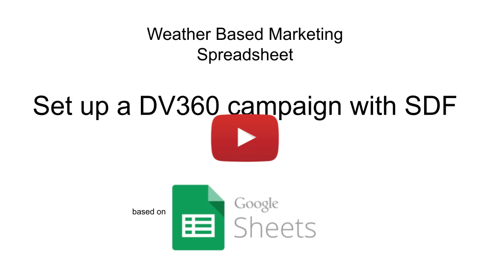
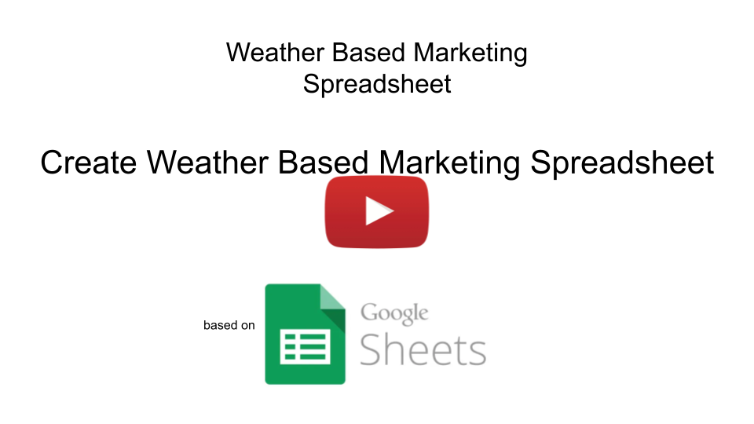

# Weather Based Marketing Spreadsheet

## Demo Video
[](http://www.youtube.com/watch?v=LPvYat0U9TI "Weather Based Marketing Spreadsheet")
YouTube Link: [youtu.be/LPvYat0U9TI](https://youtu.be/LPvYat0U9TI).

## Intro
Here you will find information on:
* How to install the Weather Based Marketing Spreadsheet.
* How to configure your DV360 campaign fast.
* How to configure your weather based Google Ads campaign.
* Tweaking your Weather Based Marketing Spreadsheet.
* How to configure different weather triggers.
* How to use other APIs beyond weather.

## Install (video tutorials can be found below)
1. Copy contents of the [all-in-one.js.txt](all-in-one.js.txt) file to your
    [apps script](https://developers.google.com/apps-script/guides/sheets#get_started) project that connected to the spreadsheet 
    (usually the default file is called "Code.gs").
2. Copy contents of the [appsscript.json](appsscript.json) file to your
    [manifest file](https://developers.google.com/apps-script/concepts/manifests). 
    (Note: first you should [enable](https://developers.google.com/apps-script/concepts/manifests#editing_a_manifest) the file in the project settings).
3. (If you want to use OpenWeather API) Add your OpenWeather API key ([get the key here](https://openweathermap.org/appid)): in the main code part ([all-in-one.js.txt](all-in-one.js.txt)) find a configuration variable "open-weather-api-key" and paste there your OpenWeather API key (your code should look like it's shown below, but with your own key).
```
  ...
  'open-weather-api-key': '202cb962ac59075b964b07152d234b70',
  ...
```

4. (Optional) If you are going to sync your spreadsheet data to DV360 (e.g. activate/pause the line items) you also need to [set your GCP project](https://developers.google.com/apps-script/guides/cloud-platform-projects) and [enable DV360 API](https://developers.google.com/apps-script/guides/cloud-platform-projects#enabling_an_api_in_a_standard_gcp_project) in that project.

## Video Tutorials
You can follow simple steps shown in the videos below to start using the Weather Based Marketing Spreadsheet.

### Set up a DV360 campaign with SDF
SDF means [Structured Data File](https://developers.google.com/bid-manager/guides/structured-data-file/format). This file is used for the bulk entity management in DV360.

[](http://www.youtube.com/watch?v=Os364xwnHN8 "Set up a DV360 campaign with SDF")
YouTube Link: [youtu.be/Os364xwnHN8](https://youtu.be/Os364xwnHN8).

### Create Weather Based Marketing Spreadsheet
This tutorial will show you main steps for Weather Based Marketing Spreadsheet creation.

[](http://www.youtube.com/watch?v=2UD1QBf9YuQ "Set up a DV360 campaign with SDF")
YouTube Link: [youtu.be/2UD1QBf9YuQ](https://youtu.be/2UD1QBf9YuQ).

### Google Ads integration
In order to integrate Weather Based Marketing Spreadsheet with [Google Ads](https://ads.google.com/) you need to:
* Adjust the spreadsheet by adding column "AdGroup Name" and populating this column by the corresponding Ad Group Names.
* Go to the Google Ads and [add an Ads Script](https://developers.google.com/google-ads/scripts/docs/your-first-script) from the file ["google-ads/switch-status.gs"](google-ads/switch-status.gs).
* In order to schedule automatic run of the Ads Script follow the [instructions](https://support.google.com/google-ads/answer/188712?hl=en).

Video tutorial will come shortly.

## Any API
Weather is one of the obvious triggers for your marketing campaign, but have you thought about what other triggers can be used? Here are several examples:
* Stock market prices
* Sport events
* Plane ticket prices
* Disease index
* Pollen index
* *... you name it*

Our spreadsheet based solution is able to handle not only weather as a trigger, but also almost any JSON based data source (e.g. API endpoint, shared by URL JSON file, etc.).

To start using this feature you should add two columns to your spreadsheet: "Api URL", "Api Headers" and populate each row of your spreadsheet with the proper:
* "Api URL": Should contain HTTP/HTTPS url of the data source (this can be e.g. Pollen Index API, Stock price API, Sport events API, etc.).
* "Api Headers": Optional. Should contain a valid JSON string with the HTTP request params (e.g. method, content type, payload, etc.). This JSON will be used as a second param for the "UrlFetchApp.fetch(url, params)" function. For more information please check [the doc](https://developers.google.com/apps-script/reference/url-fetch/url-fetch-app#fetch(String,Object)).
* In the both columns you can use placeholders in the form `` (where `<Column Name>` is any other column name from the same spreadsheet). Before making the http request our tool will automatically replace these placeholders (the whole string like ``) by the value found in the cell located in the same row under the column with the name `<Column Name>`.
* You can use the same 'api:*' notation (see below) to access "Any API" data points.

**NOTE**: In order to run the "Any API" related functionality, please check the list of "Main Apps Script functions" below.

## Main Apps Script functions
Here are the main functions that fetch the input API data and sync results to DV360:
* `monitorWeatherAndSyncWithDV360`: will check the settings from the weather triggers spreadsheet, get response from the OpenWeather API, write it back to the spreadsheet and sync the Line Item or Insertion Order status to DV360 (row by row).
* `checkWeather`: will do the same as the previous function, but _will not_ sync with DV360.
* `syncWithDV360`: will only sync with DV360.
* `checkApi`: will only fetch the "Any API" data into your spreadsheet.
* `checkApiAndSyncWithDV360`: will both fetch the "Any API" and sync with DV360 (row by row).

This is how to run these functions: 
* From the Apps Script development environment (by selecting the function name from the drop-down and [clicking "Run"](https://developers.google.com/apps-script/overview#try_it_out)).
* You can trigger them from the [spreadsheet menu](../imgs/spreadsheet-menu.png): 
  * `monitorWeatherAndSyncWithDV360`: "Weather Based Marketing > Check weather and sync DV360".
  * `checkWeather`: "Weather Based Marketing > Only check weather"
* Schedule them with the Apps Script [Time-driven triggers](https://developers.google.com/apps-script/guides/triggers).

## Configure Apps Script
Main configuration class can be found in the [classes/config.gs](classes/config.gs) file. Here are some of the configuration variables (most of them are optional):
* `open-weather-api-key` (mandatory field if you use OpenWeather API): This is an Openweather API key, which you can [get here](https://openweathermap.org/appid) (free version is usually enough).
* `open-weather-api-units`: Options **"metric"** OR **"imperial"**. By default our tool works with the weather data in the "metric" units.
* `service-account`: To access DV360 API you can use either use a current account (the one, which executed the apps script) or you can use a custom [service account](https://cloud.google.com/iam/docs/service-accounts). If you are going to use a service account, please don't forget to [give the right access](https://support.google.com/displayvideo/answer/2723011?hl=en) for this account in your DV360 settings (since it will activate/deactivate DV360 entities it needs "write" access).
* `spreadsheet-id`: By default main Apps Script functions will check the configuration from the spreadsheet associated with the current Apps Script (a.k.a. [the container](https://developers.google.com/apps-script/guides/bound)), but you can change this by specifying another spreadsheet ID (please make sure that user, who runs the Apps Script has access to that spreadsheet).
* `sheet-name`: By default main Apps Script functions will check the configuration from the sheet (tab) called "_Triggers_", but you can change it by specifying another sheet name.
* `hours-between-updates`: This setting allows you to process your spreadsheet in batches. Sometimes you will have a very long table with the weather triggers and locations (imagine you target 5 weather conditions in 50 locations, which equals to 250 rows in the table). At the same time Apps Script has a [limitation](https://developers.google.com/apps-script/guides/services/quotas#current_limitations) on the execution time. You can run your script several times (one after another) and if some rows were already processed during last `hours-between-updates` hours (e.g. during the last run) then these rows will be skipped.
* All `col-*`: Spreadsheet column name configuration, see the section "[Configure the Weather Triggers Spreadsheet](#configure-the-weather-triggers-spreadsheet)".

## Configure the Weather Triggers Spreadsheet
Based on the column names in your trigger configuration sheet (by default named "_Triggers_") main Apps Script decides how to process your list. These names can be configured in the [classes/config.gs](classes/config.gs) file.
This section contains a list of default names of the columns and their purpose:
* 'Line Item Id' (optional, config class variable `col-line-item-id`): The value from this cell will be used to sync the Line Item status (activate it or pause) to DV360 API. First the script tries to sync the Line Item, if this column is not found, then Insertion Order Id will be used to sync.
* 'Insertion Order Id' (optional, config class variable `col-insertion-order-id`): The value from this cell will be used to sync the Insertion Order status (activate it or pause) to DV360 API. If both 'Line Item Id' and 'Insertion Order Id' are empty, then no DV360 sync will be performed.
* 'Advertiser ID' (optional, config class variable `col-advertiser-id`): The value from this cell will be used to sync the Insertion Order or Line Item status (both DV360 API methods require the advertiser id). This field is required if at least one of these fields is not empty: 'Line Item Id' or 'Insertion Order Id'.
* 'Latitude' (mandatory, config class variable `col-lat`): Geo coordinates. Will be used to fetch the weather conditions for the row from the sheet.
* 'Longitude' (mandatory, config class variable `col-lon`): Geo coordinates. Will be used to fetch the weather conditions for the row from the sheet.
* 'Activation Formula' (optional, config class variable `col-formula`): This is a custom formula. It's value is used to activate or deactivate the DV360 entities (e.g. Line Items). If the formula returns `TRUE`, then the DV360 entity will be activated, else (cell contains `FALSE`) it will be paused.
* 'Last Updated' (updated by the script, config class variable `col-last-updated`): This column will be updated automatically by the script and contain the timestamps of when this row was last processed by a particular data processor (e.g. when weather data was last fetched or when the row's status was synced with DV360 API).

### 'api:*' Notation (API data points)
These are the columns which will be populated by the script according to the fetched API output JSON.

For example the Openweather API output (for the chosen Latitude, Longitude) has a JSON format. You can fetch any particular variable to the corresponding cell from the JSON output by putting a correct variable path to the 'api:*' field name. Especially the format is: `api:<variable>[.<variable>[.<variable>]]`. Where `<variable>` is a string or integer:
* by specifying integer as a `variable` you can access array elements from the JSON. Remember the array numeration starts from 0 (0 is the first array element, 1 - second, and so on).
* by specifying string as a `variable` you can access JSON properties with the string names.

By default, Openweather API allows you to access many data points, such as: *temperature, precipitation, sunrise/sunset, pressure, humidity, UV index, clouds, visibility, wind, etc*. 

Examples (you can check the Openweather API [JSON here](https://openweathermap.org/api/one-call-api#example)):
* Column name `api:daily.0.clouds`: will put into the corresponding cell the today's % of clouds.
* Column name `api:daily.0.rain`: will put into the corresponding cell the today's mm of rain.
* Column name `api:daily.0.temp.max`: will put into the corresponding cell the today's maximum temperature (by default in "°C").
* Column name `api:daily.0.feels_like.!MIN`: this is an aggregated value, the script will find the minimum value among the daily "feels like" temperature array.

#### More examples:


### Activation formula
Activation formula implements the weather conditions which should trigger the marketing action (in our case activate or deactivate the DV360 entities).

If the "Activation formula" value is **TRUE**, then the corresponding DV360 *Line Item* (or *Insertion Order* or Google Ads *Ad Group*) will be **activated**, if it's **FALSE** it will be **paused**.

Now you know how to extract the needed data points from the weather JSON. Based on these data points you can write your activation formulas.

Here are several examples for the activation formula:
* "Cloudy" (clouds are more than 20%): ` =K2>20` (where "K1" cell contains the name `api:daily.0.clouds`).
* "Cold" (maximum daily temperature is below then 10°C):` =L2<10` (where "L1" cell contains `api:daily.0.temp.max`).
* "Rainy" (at least 15mm per day): ` =M2>=15` (where "M1" cell contains `api:daily.0.rain`).
* Note, that you can combine the conditions with `=AND(...)` or/and `=OR(...)` functions. E.g. ` =OR(K2>20, M2>=15)` means that the corresponding Insertion Order or Line Item will be activated in case one of the conditions is satisfied (you can name this condition "rainy or cloudy").